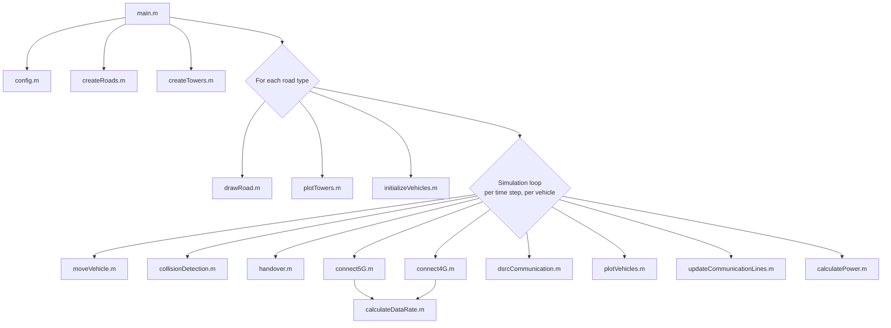

# 5G-V2X-Communication

**A modular MATLAB simulation framework for Vehicle-to-Vehicle (V2V) and Vehicle-to-Infrastructure (V2I) communication over 4G and 5G networks, with DSRC-based V2V beaconing.**


This repository accompanies the IEEE paper **"[Full Paper Title Here]"** ([DOI / IEEE Xplore link]). It models vehicles moving along different road topologies while dynamically connecting to a mix of 5G small cells and a 4G macro cell, performing tower handovers, estimating link data rates, and exchanging basic safety beacons with nearby vehicles over DSRC.

> 📌 **Before publishing:** replace the bracketed placeholders above (paper title, DOI, author names) and in [`CITATION.cff`](CITATION.cff) and [`LICENSE`](LICENSE) with your actual details.

---

## Overview

The simulation places vehicles on one of four road topologies (Square, Triangle, Straight, Zigzag) and, at every time step, each vehicle:

1. **Moves** along its road segment at a randomly assigned cruising speed.
2. **Checks for collisions** against nearby vehicles and slows down if another vehicle gets too close.
3. **Connects to infrastructure (V2I)** — it looks for the nearest 5G tower and hands over to it if in range; otherwise it falls back to the 4G macro cell; otherwise it is marked out of coverage. An approximate data rate is computed based on distance to the serving tower.
4. **Beacons over DSRC (V2V)** — it exchanges position/speed information with any other vehicle within DSRC range.

The network's approximate power draw is also logged per time step, based on how many vehicles are currently connected.

## Key Features

- **Two-tier cellular model**: 3 overlapping 5G small cells (hexagonal footprint) + 1 4G macro cell (circular footprint), with automatic handover and fallback.
- **DSRC V2V beaconing** with configurable range and message latency.
- **Simple collision-avoidance model** based on inter-vehicle distance thresholds.
- **Four road topologies** out of the box (easy to extend — see [`roads/createRoads.m`](roads/createRoads.m)).
- **Fully modular codebase** — every concern (roads, towers, vehicle motion, communication, metrics, visualization) lives in its own function, making the model easy to read, test, and extend.

## Repository Structure

```text
5G-V2X-Communication/
│
├── README.md
├── LICENSE
├── CITATION.cff
├── .gitignore
├── main.m                        # Entry point — run this
├── config.m                      # All tunable simulation parameters
│
├── roads/
│   ├── createRoads.m             # Road waypoint definitions
│   └── drawRoad.m                # Road plotting
│
├── towers/
│   ├── createTowers.m            # 5G/4G base-station placement
│   └── plotTowers.m              # Tower + coverage-area plotting
│
├── vehicles/
│   ├── initializeVehicles.m      # Random vehicle placement & speeds
│   ├── moveVehicle.m             # Per-step motion along the road
│   └── collisionDetection.m      # Proximity warnings & speed control
│
├── communication/
│   ├── handover.m                # Nearest-5G-tower handover logic
│   ├── connect5G.m                # 5G coverage + data-rate check
│   ├── connect4G.m                # 4G coverage + data-rate check
│   └── dsrcCommunication.m       # DSRC V2V beaconing
│
├── metrics/
│   ├── calculateDataRate.m       # Shared distance-based data-rate model
│   └── calculatePower.m          # Network power-consumption estimate
│
├── visualization/
│   ├── plotVehicles.m            # Vehicle marker/label updates
│   └── updateCommunicationLines.m# V2I link line updates
│
├── images/                       # Put exported figures here (see below)
└── Results/                      # Suggested location for logged/exported run data
```

## Architecture / Data Flow



## Requirements

- MATLAB **R2017b or later** (only requirement is the built-in `vecnorm` function).
- No additional toolboxes required — everything uses base MATLAB graphics and math functions.

## Installation

```bash
git clone https://github.com/[your-username]/5G-V2X-Communication.git
cd 5G-V2X-Communication
```

## Usage

Open MATLAB, `cd` into the repository root, and run:

```matlab
main
```

This opens one figure per road topology (Square, Triangle, Straight, Zigzag) and animates all vehicles for `simulationTime` seconds. Progress — handovers, connections, data rates, DSRC exchanges, and power draw — is printed to the Command Window as the animation runs.

To change the scenario, edit [`config.m`](config.m) — no other file needs to change. For example, to simulate 12 vehicles for a shorter run:

```matlab
% in config.m
cfg.numVehicles    = 12;
cfg.simulationTime = 40;
```

## Configuration Reference

All parameters live in [`config.m`](config.m):

| Parameter | Description | Default |
|---|---|---|
| `towerRadius5G` | 5G tower coverage radius (m) | 50 |
| `towerRadius4G` | 4G tower coverage radius (m) | 70 |
| `numVehicles` | Number of simulated vehicles | 6 |
| `simulationTime` | Total simulated time (s) | 100 |
| `timeStep` | Simulation time step (s) | 0.5 |
| `minVehicleSpeed` / `maxVehicleSpeed` | Vehicle speed range (m/s) | 20 / 80 |
| `v2vDistanceThreshold` | Distance that triggers a V2V proximity warning (m) | 20 |
| `handoverThreshold` | Distance that triggers a logged 5G handover (m) | 10 |
| `minSafeDistance` | Distance below which a vehicle is forced to minimum speed (m) | 5 |
| `baseStationPower` | Power drawn per connected vehicle (W) | 0.1 |
| `maxDataRate5G` / `minDataRate5G` | 5G data-rate bounds (Mbps) | 1000 / 100 |
| `mimoAntennas` | 5G MIMO antenna count (reported, informational) | 8 |
| `maxDataRate4G` / `minDataRate4G` | 4G data-rate bounds (Mbps) | 300 / 50 |
| `dsrcRange` | DSRC V2V range (m) | 300 |
| `dsrcLatency` | DSRC message latency (s) | 0.01 |

## Reading the Output

**Plot colors:**
- 🟢 Green vehicle marker/link — connected to a 5G tower
- 🔵 Blue vehicle marker/link — connected to the 4G tower
- 🔴 Red vehicle marker — out of range of both networks

**Console log:** each time step prints, per vehicle, any proximity warnings, handover events, the serving tower and estimated data rate (or out-of-range status), DSRC exchanges with nearby vehicles, and the aggregate network power draw for that step.

## Screenshots

_Add exported figures from your own runs here, e.g._

```matlab
exportgraphics(gcf, 'images/square_road.png', 'Resolution', 200);
```

then reference them in this section, for example:

```markdown

```

## Citation

If you use this code in academic work, please cite the accompanying paper (see [`CITATION.cff`](CITATION.cff) for the machine-readable version):

```bibtex
@INPROCEEDINGS{yourkey2026,
  author  = {[Author names]},
  title   = {[Full paper title]},
  booktitle = {[IEEE Conference/Journal name]},
  year    = {2026},
  doi     = {[DOI]}
}
```

## Notes on This Refactor

This codebase is a direct, modular refactor of the original single-script simulation — the underlying model (motion, collision rule, handover/coverage logic, DSRC beaconing, power model) is unchanged. Two small correctness fixes were made along the way:

- `baseStationPower` is now properly terminated with a semicolon (previously it was echoed to the console on every run).
- `handover.m` now compares against the actual `handoverThreshold` parameter instead of a hardcoded `10` (the two happened to have the same value, so behavior is identical, but the code now stays correct if you change the threshold in `config.m`).

The duplicated 5G/4G data-rate formula was also consolidated into a single shared function, [`calculateDataRate.m`](metrics/calculateDataRate.m).

## Limitations

This is a simplified, paper-scale demonstration model rather than a validated network simulator: propagation is a linear distance fall-off (no shadowing/fading), collision avoidance is a threshold rule rather than a physical model, and DSRC/cellular coexistence is not modeled at the PHY/MAC level. See the paper for the intended scope and assumptions.

## Contributing

Issues and pull requests are welcome — please open an issue first for any significant change so it can be discussed against the paper's intended scope.

## License

Released under the [MIT License](LICENSE).

## Contact

**[Tanikella Aditya Kapil]** — [tanikella.kapil@gmail.com]
